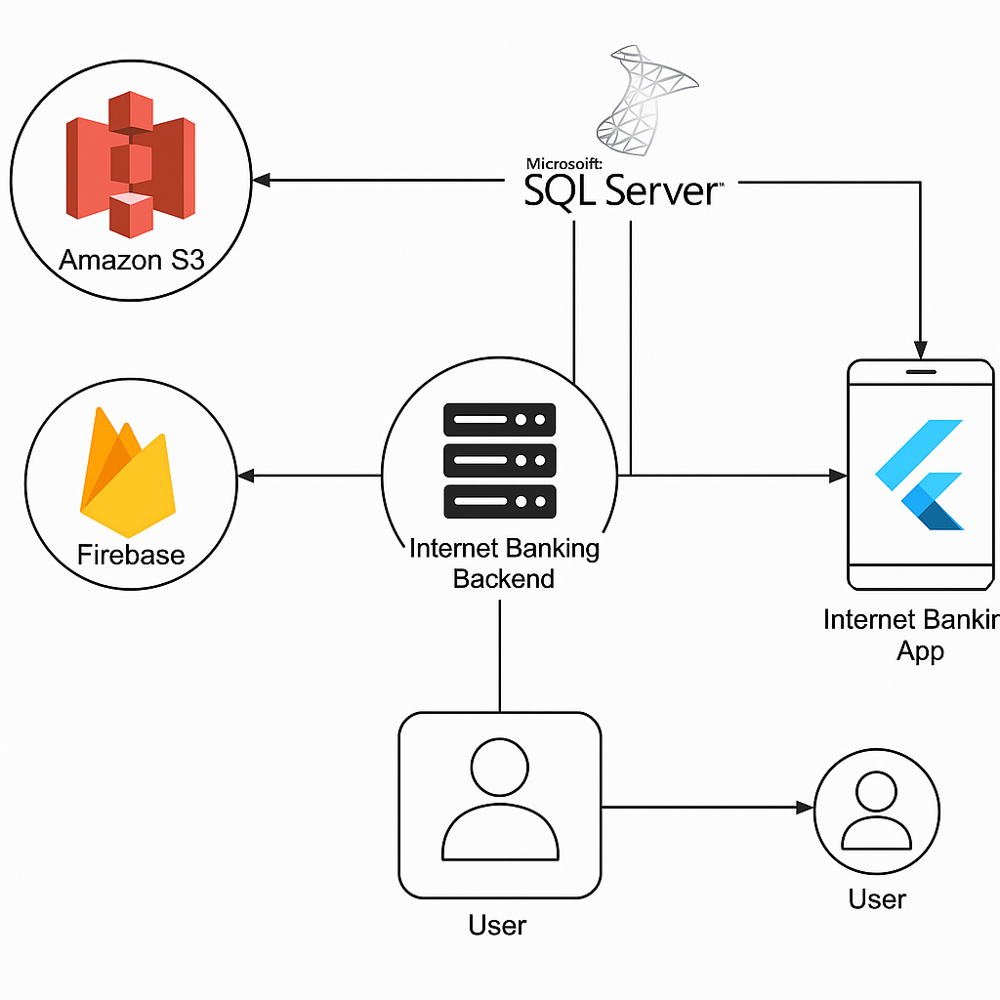

<!--
███████████████████████████████████████████████████████████████████
README.md cho dự án Internet Banking Flutter + .NET API
Tạo bởi: Anh Khoa
Ngày: YYYY-MM-DD
███████████████████████████████████████████████████████████████████
-->

<!-- ===========================
     BANNER & BADGES
=========================== -->

<p align="center">
   
   
   
  
</p>

<p align="center">
    
  
</p>

<h1 align="center">🏦 Internet Banking App</h1>
<p align="center">Một ứng dụng ngân hàng điện tử (Internet Banking) đa nền tảng, bao gồm <strong>Flutter Frontend</strong> và <strong>.NET Core API Backend</strong>.</p>

---

## 📖 Mục Lục

1. [Giới thiệu](#-giới-thiệu)
2. [Tính năng chính](#-tính-năng-chính)
3. [Kiến trúc &amp; Công nghệ sử dụng](#-kiến-trúc--công-nghệ-sử-dụng)
4. [Yêu cầu hệ thống](#-yêu-cầu-hệ-thống)
5. [Hướng dẫn cài đặt và chạy](#-hướng-dẫn-cài-đặt-và-chạy)
   - [Backend (.NET Core API)](#backend-net-core-api)
   - [Frontend (Flutter)](#frontend-flutter)
6. [Ảnh chụp màn hình](#-ảnh-chụp-màn-hình)
7. [Cấu trúc thư mục](#-cấu-trúc-thư-mục)
8. [Biến môi trường &amp; Cấu hình](#-biến-môi-trường--cấu-hình)
9. [License](#-license)
10. [Liên hệ](#-liên-hệ)

---

## 📌 Giới thiệu

Ứng dụng **Internet Banking** này cung cấp các tính năng cơ bản và nâng cao cho người dùng cá nhân (khách hàng) như:

- **Đăng nhập / Đăng ký** tài khoản qua email, mật khẩu (hoặc OTP).
- **Xem thông tin tài khoản**: số dư, lịch sử giao dịch.
- **Chuyển tiền nội bộ / liên ngân hàng**.
- **Quản lý thẻ**: kích hoạt/thanh toán thẻ tín dụng, thẻ ghi nợ.
- **Thanh toán hóa đơn** (điện, nước, internet,…).
- **Thông báo & Tin nhắn** (thông báo giao dịch, OTP).
- **Báo cáo và biểu đồ** (thống kê chi tiêu hàng tháng).
- **Quản lý thông tin người dùng**: cập nhật hồ sơ, thay đổi mật khẩu.

Phần **Backend** được xây dựng bằng **ASP.NET Core (8.0)**, đảm nhận nhiệm vụ:

- Xác thực & cấp phát token JWT.
- Expose RESTful API cho các tính năng chính.
- Kết nối và tương tác với SQL Server (hoặc các DBMS khác).
- Quản lý logic nghiệp vụ (chuyển tiền, tính phí, lịch sử giao dịch).

Phần **Frontend** dùng **Flutter (>= 3.2)** để triển khai giao diện đa nền tảng (iOS/Android/Web), tương thích với các thiết bị di động và web browser.

---

## 🌟 Tính năng chính

- 🔐 **Xác thực & Phân quyền**: JWT Authentication, Role-based Access Control (Admin, Customer).
- 💳 **Quản lý tài khoản & Thẻ**: Xem số dư, khóa/mở thẻ, thanh toán dư nợ.
- 💸 **Chuyển tiền**: chuyển nội bộ, chuyển liên ngân hàng (IBAN/SWIFT code).
- 📈 **Báo cáo chi tiêu**: biểu đồ giao dịch theo ngày, tháng, năm.
- 🧾 **Thanh toán hóa đơn**: điện, nước, internet, truyền hình cáp, v.v.
- 🔔 **Thông báo đẩy**: đẩy thông báo khi giao dịch có thay đổi.
- 👤 **Quản lý hồ sơ**: cập nhật thông tin cá nhân, thay đổi mật khẩu.
- ⚙️ **Quản trị hệ thống**: Admin có thể phê duyệt giao dịch, quản lý người dùng.
- 📊 **Dashboard**: Hiển thị thống kê nhanh các chỉ số tài chính.

---

## 🛠️ Kiến trúc & Công nghệ sử dụng


<p align="center">
  
</p>


- **Backend**:

  - ASP.NET Core 8.0
  - Entity Framework Core
  - SQL Server
  - AutoMapper
  - Swashbuckle (Swagger) cho tài liệu API
  - CQRS
  - JWT (Json Web Token)
  - Dependency Injection (DI)
  - Dapper (tùy chọn cho query tối ưu)
  - Biểu đồ và Báo cáo: ChartJS hoặc thư viện tương đương (nếu triển khai trên web admin)
- **Frontend**:

  - Flutter 3.2+ (Dart >= 3.7.2)
  - Provider / Riverpod / BLoC (State Management)
  - Dio (Networking)
  - Flutter Secure Storage (lưu trữ token JWT)
  - Flutter Charts (cho biểu đồ thống kê)
  - Flutter Local Notifications (thông báo đẩy cục bộ)
  - intl (quốc tế hóa, định dạng tiền tệ)
- **DevOps / CI-CD** (gợi ý, tùy bạn):

  - GitHub Actions / Azure DevOps Pipelines / GitLab CI
  - Docker & Docker Compose
  - Kubernetes / Azure AKS / AWS EKS (nâng cao)
  - Azure App Service / AWS Elastic Beanstalk / Heroku

---

## 💻 Yêu cầu hệ thống

### Backend (.NET Core API)

- .NET 8.0 SDK trở lên (hoặc .NET 6.0 SDK)
- SQL Server 2022 (hoặc PostgreSQL, MySQL)
- Entity Framework Core CLI (nếu cần migrations)
- Postman / Insomnia (để test API)

### Frontend (Flutter)

- Flutter SDK >= 3.2.x
- Android Studio / Xcode (để chạy trên thiết bị ảo hoặc thật)
- Android Emulator / iOS Simulator (nếu phát triển trên máy)
- Git (để clone và quản lý mã nguồn)

---

## 🚀 Hướng dẫn cài đặt và chạy

### 1. Chuẩn bị Environment Variables

Trước khi chạy, bạn cần tạo hoặc sao chép file cấu hình môi trường cho backend:

```bash
# Tạo file appsettings.Development.json (hoặc appsettings.Local.json)
cp appsettings.Development.example.json appsettings.Development.json
```
